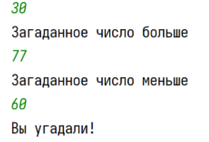

Напишите в нём программу-игру, в которой пользователь будет угадывать некое число, а программа, если он не угадал, будет сообщать ему, больше или меньше введённое им число, чем загаданное. 
Например: 
