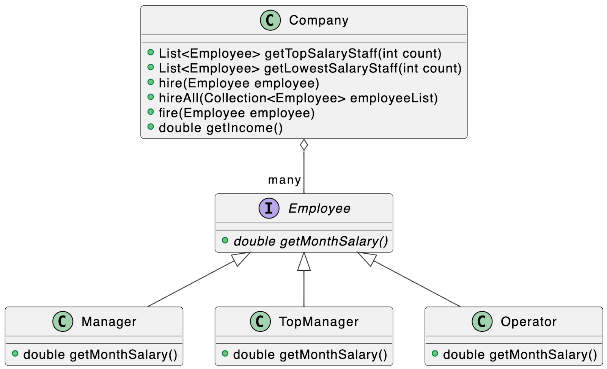

<h4 fr-original-style="" style="font-size: 1.5rem; margin-top: 0px; margin-bottom: 0.5rem; color: inherit; line-height: 1.2; font-weight: 500; box-sizing: border-box;">Цель</h4>

Научиться работать с интерфейсами, абстрактными классами и взаимодействием классов.

<h4 fr-original-style="" style="font-size: 1.5rem; margin-top: 0px; margin-bottom: 0.5rem; color: inherit; line-height: 1.2; font-weight: 500; box-sizing: border-box;">Что нужно сделать</h4>

1. Создайте класс компании Company, содержащей сотрудников и реализующей методы:

<ul fr-original-style="" style="margin-top: 0px; margin-bottom: 1rem; box-sizing: border-box; font-size: 16px; line-height: 22px;"><li fr-original-style="" style="box-sizing: border-box;">найм одного сотрудника — hire(Employee employee),</li><li fr-original-style="" style="box-sizing: border-box;">найм списка сотрудников – hireAll(Collection&lt;Employee&gt; employes),</li><li fr-original-style="" style="box-sizing: border-box;">увольнение сотрудника – fire(Employee employee),</li><li fr-original-style="" style="box-sizing: border-box;">получение значения дохода компании – getIncome().</li></ul>

Каждый метод <strong fr-original-style="" style="font-weight: 700; box-sizing: border-box;">НЕ должен</strong> иметь модификатор static, это позволит каждому объекту класса Company иметь свой набора сотрудников, свой расчет дохода, увольнение и найм. Аргументы и возвращаемое значение методов выберите на основании логики работы вашего приложения.

 2. Создайте два метода, возвращающие список указанной длины (count). Они должны содержать сотрудников, отсортированных по убыванию и возрастанию заработной платы:

<ul fr-original-style="" style="margin-top: 0px; margin-bottom: 1rem; box-sizing: border-box; font-size: 16px; line-height: 22px;"><li fr-original-style="" style="box-sizing: border-box;">List&lt;Employee&gt; getTopSalaryStaff(int count),</li><li fr-original-style="" style="box-sizing: border-box;">List&lt;Employee&gt; getLowestSalaryStaff(int count).</li></ul>

 3. Создайте классы сотрудников с информацией о зарплатах и условиями начисления зарплаты:

<ul fr-original-style="" style="margin-top: 0px; margin-bottom: 1rem; box-sizing: border-box; font-size: 16px; line-height: 22px;"><li fr-original-style="" style="box-sizing: border-box;">Manager — зарплата складывается из фиксированной части и бонуса в виде 5% от заработанных для компании денег. Количество заработанных денег для компании генерируйте случайным образом от 115 000 до 140 000 рублей.</li><li fr-original-style="" style="box-sizing: border-box;">TopManager — зарплата складывается из фиксированной части и бонуса в виде 150% от заработной платы, если доход компании более 10 млн рублей.</li><li fr-original-style="" style="box-sizing: border-box;">Operator — зарплата складывается только из фиксированной части.</li></ul>

Каждый класс сотрудника должен имплементировать интерфейс Employee. В интерфейсе Employee должен быть объявлен метод, возвращающий зарплату сотрудника, — getMonthSalary().

Аргументы и возвращаемое значение метода выберите в соответствии с логикой начисления зарплат. В интерфейсе объявите необходимые методы.

Для демонстрации и тестирования работы ваших классов:

<ol fr-original-style="" style="margin-top: 0px; margin-bottom: 1rem; box-sizing: border-box; font-size: 16px; line-height: 22px;"><li fr-original-style="" style="box-sizing: border-box;">Создайте и наймите в компанию: 180 операторов Operator, 80 менеджеров по продажам Manager, 10 топ-менеджеров TopManager.</li><li fr-original-style="" style="box-sizing: border-box;">Распечатайте список из 10–15 самых высоких зарплат в компании.</li><li fr-original-style="" style="box-sizing: border-box;">Распечатайте список из 30 самых низких зарплат в компании.</li><li fr-original-style="" style="box-sizing: border-box;">Увольте 50% сотрудников.</li><li fr-original-style="" style="box-sizing: border-box;">Распечатайте список из 10–15 самых высоких зарплат в компании.</li><li fr-original-style="" style="box-sizing: border-box;">Распечатайте список из 30 самых низких зарплат в компании.</li></ol>